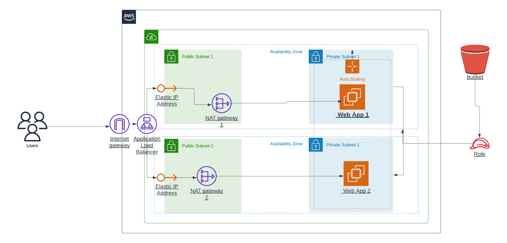

# PROJECT SPECIFICATION
Deploy a High-Availability Web App using CloudFormation 
## The Basics
1. Parameters 
2. Resources
3. Outputs
4. Working Test
## Load Balancer
1. Target Group
2. Health Check and Listener
## Auto-Scaling
1. Subnets
2. Machine Specs
3. SSH Key

### Diagram

---
### Website Link
http://udagram-1356082084.us-east-1.elb.amazonaws.com/
---
### Screenshots of AWS Cloudformation Stacks

